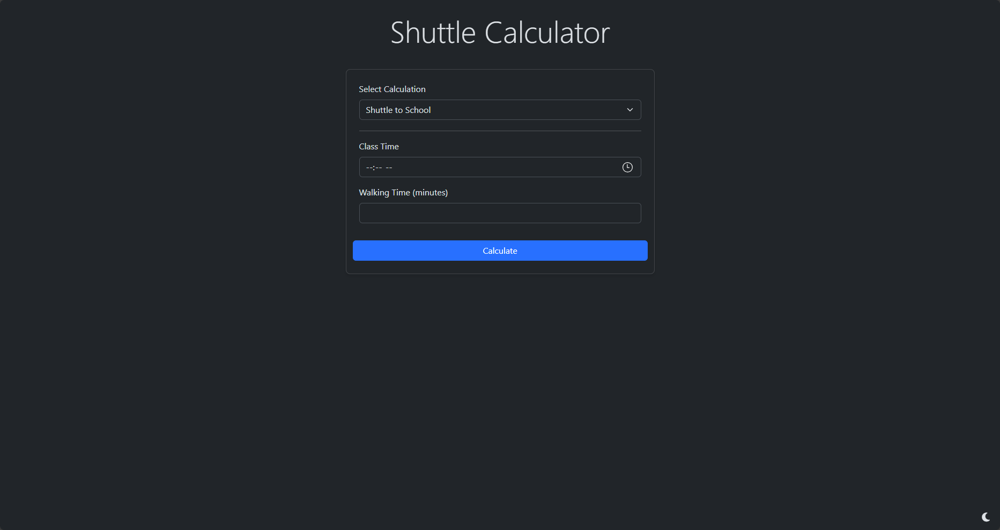

# Shuttle Calculator
> Local website to help easily handle figuring out when the next available shuttle is and how long can be spent as a break while returning.

## Features
- 3 Different Calculation Options
  - Find When to Take a Shuttle to School
  - Find When The Next Shuttle is
  - Do Both in Conjunction to Decide to Take a Break
- Allows custom shuttle times
  - Saves settings to local storage
- Header Animation
- Dark/Light Mode

## To-Do
- Ambiguate "class" terms
- Allow A & B calculation from both locations
- Mobile support 