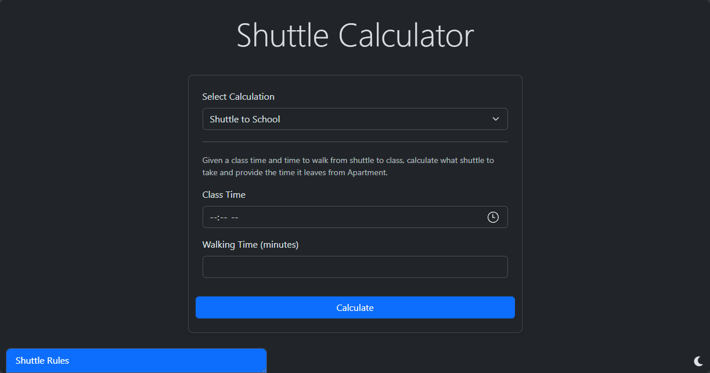

# 🚎 Shuttle Calculator

 

> Local website to help easily handle finding available shuttles and calculating when to take them.

## Features
- 3 Different Calculation Options
  - Find When to Take a Shuttle to School
  - Find When The Next Shuttle is
  - Do Both in Conjunction and Find Break Times
- Allows custom shuttle times
  - Saves settings to local storage
- Header Animation
- Dark/Light Mode

## Next Steps
- Ambiguate "class" terms
- Allow A & B calculation from both locations
- Mobile support 